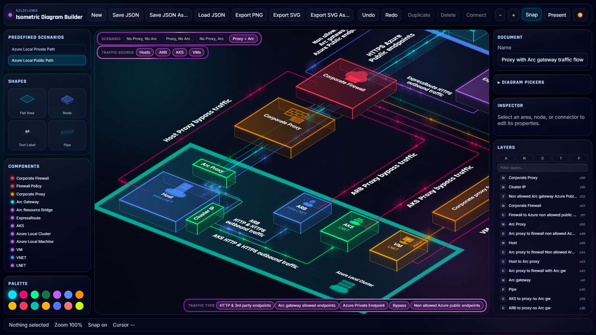

# AzLoFlows — Isometric Diagram Builder

AzLoFlows is an interactive, browser-based isometric diagram builder designed for visualizing Azure Local (formerly Azure Stack HCI) network architectures and traffic flows. It renders cloud infrastructure components — firewalls, proxies, Arc gateways, clusters, VMs, private endpoints, and more — as isometric 3D cards on a dark-themed canvas, connected by animated flow lines that represent real network paths.

The tool is purpose-built for understanding and communicating how traffic moves through Azure Local deployments under different configurations: with or without a corporate proxy, with or without an Arc gateway, across public and private paths.



## Live Demo

**[https://cristianedwards.github.io/AzLoFlows/](https://cristianedwards.github.io/AzLoFlows/)**

## Features

### Isometric Canvas
- Pan, zoom, snap-to-grid, and drag-to-move editing on an isometric projection
- Flat grouping areas rendered as isometric surfaces (e.g., "On-Premises", "Azure Cloud")
- Raised node cards with color-coded glow effects and Azure-themed icons
- Connectors with labels, animated flow particles, and routed waypoints
- Pipe entities for representing network segments
- Freely placeable text labels with rotation support

### Scenario-Based Flow Visualization
- **Predefined scenarios**: Load ready-made diagrams for Azure Local Public Path and Private Path architectures
- **Scenario picker**: Toggle between configurations — No Proxy/No Arc, Proxy only, Arc only, Proxy + Arc
- **Traffic source filtering**: Show flows from Hosts, ARB, AKS, VMs, or any combination
- **Traffic type filtering**: Filter by HTTP/third-party endpoints, Arc gateway allowed endpoints, Azure Private Endpoints, bypass routes, and non-allowed Azure public endpoints
- Tag-based visibility: each entity and connector is tagged, so filtering dynamically shows/hides the relevant parts of the diagram

### Diagram Editing
- **Shape palette**: Drag-and-drop areas, nodes, text labels, and pipes onto the canvas
- **Component templates**: Pre-configured Azure node types (Firewall, Proxy, Arc Gateway, AKS, VMs, VNET, DNS, Key Vault, Private Endpoint, etc.)
- **Inspector panel**: Edit properties (color, label, size, icon, anchors) of selected entities
- **Layers panel**: Reorder and manage entity draw order
- **Connectors**: Connect nodes via anchor points with animated dashed or solid lines
- **Snap alignment guides**: Smart snapping when dragging entities near each other
- **Undo/redo** with full history stack
- **Duplicate and delete** selected entities
- **Minimap** for quick navigation on large diagrams

### Export & Persistence
- **Export PNG**: Preview dialog with download or Save As
- **Export SVG**: Vector export preserving the isometric rendering, glow effects, and flow animations
- **Save/Load JSON**: Full document serialization for sharing and version control
- **Auto-save**: Diagrams persist to local storage automatically
- **Present mode**: Hide UI chrome for clean full-screen presentation

### Theming
- Dark and light theme toggle
- Glassmorphic UI panels with blur and glow effects
- Color palette with 14 pre-defined swatches

## Development

```bash
npm install
npm run dev        # http://localhost:8125/AzLoFlows/
npm run build      # production build → dist/
```

## Architecture

| Path | Purpose |
|------|---------|
| `src/state` | Document state, UI state, undo/redo, and actions (Zustand) |
| `src/lib/geometry` | Isometric projection, grid snapping, bounds, anchors, and connector routing |
| `src/lib/rendering` | Reusable design tokens and canvas drawing primitives |
| `src/features/canvas/renderers` | Background, grid, areas, connectors, nodes, pipes, text, selection, and scene composition |
| `src/features/*` | Palette, inspector, export helpers, scenarios, templates, layers |
| `src/app` | Shell layout and top-level composition |
| `src/types/document.ts` | Core type definitions and scenario/flow-type constants |

The document stores logical flat coordinates. Projection into isometric screen space only happens during rendering and hit testing, which keeps serialization and editing rules stable.

## License

See [LICENSE](LICENSE).